# Webbased Blackjack

A web-based Blackjack game built with vanilla JavaScript, HTML, and CSS.

> **School assignment** for the Web Development course at IT-Högskolan (ITHS).

---

## Screenshots

### Authentication

| Login | Create Account |
|:---:|:---:|
| 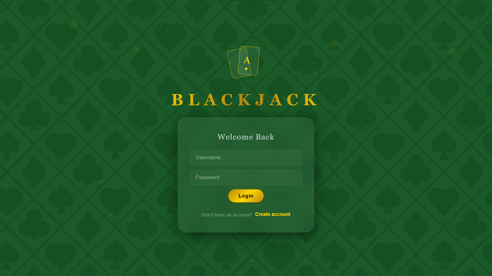 | 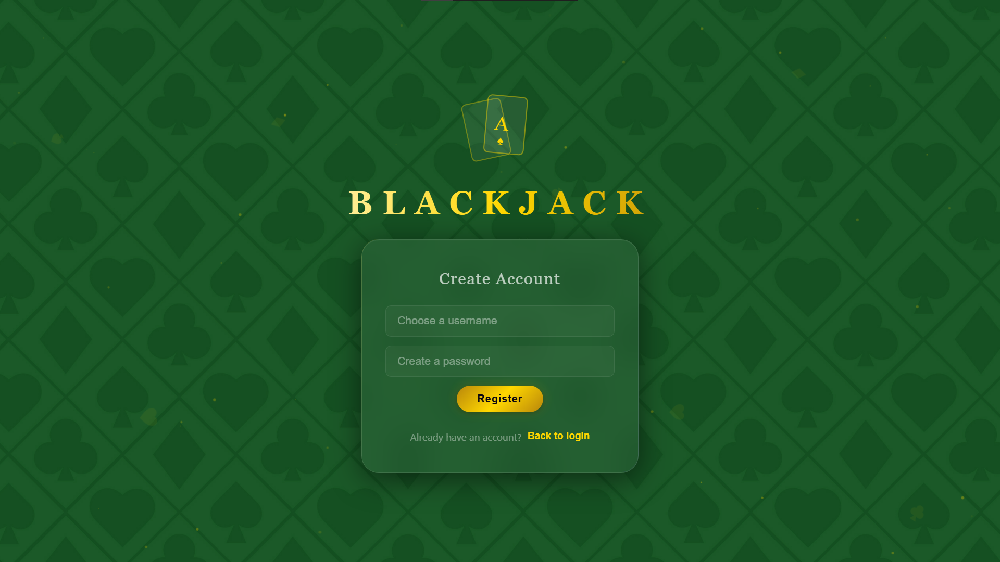 |

### Gameplay

| Game Table | During a Match |
|:---:|:---:|
| 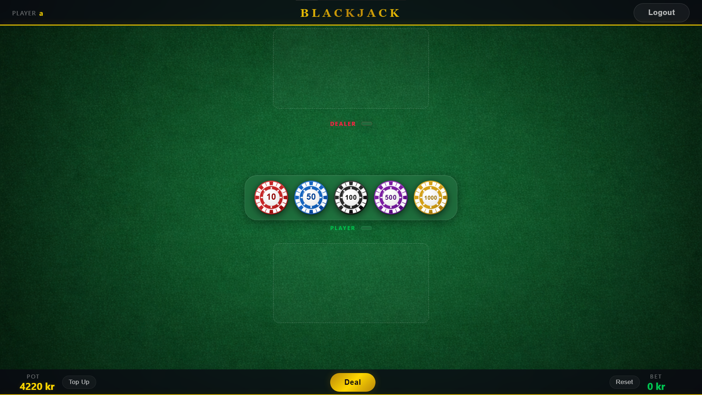 | 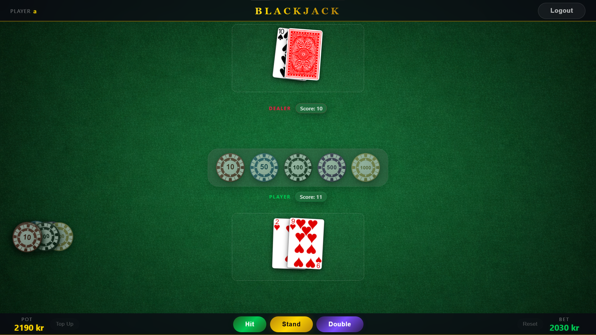 |

### Betting

| Placing Chips | Blackjack |
|:---:|:---:|
| 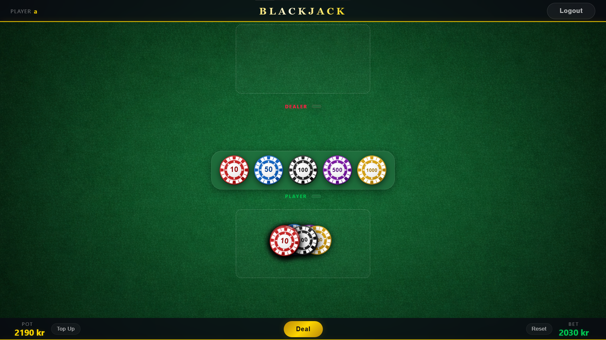 | 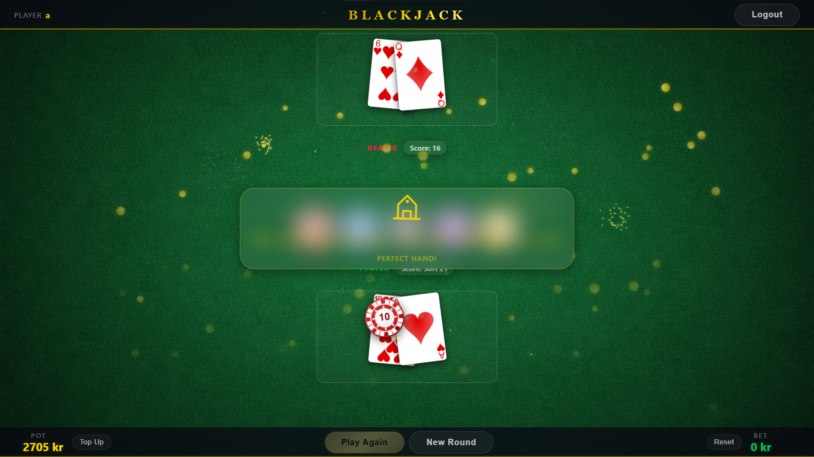 |

### Results

| Win | Loss | Tie (Push) |
|:---:|:---:|:---:|
| 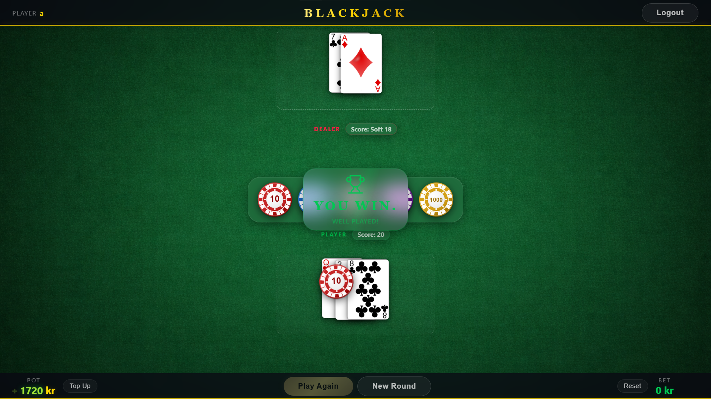 | 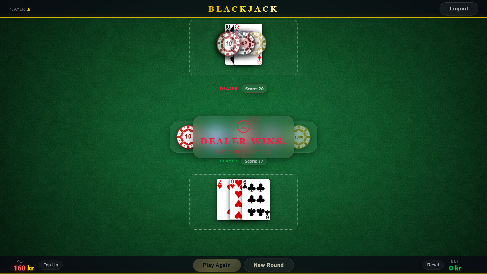 | 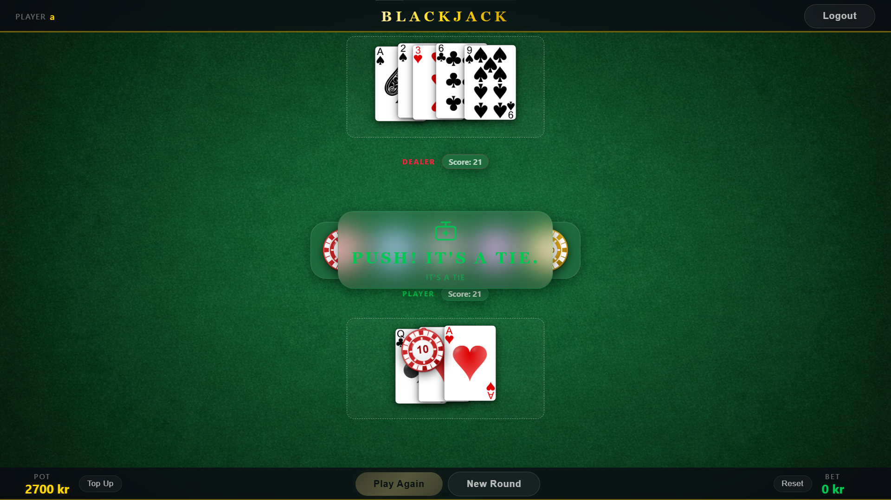 |

| Dealer Bust (Win) | Player Bust (Loss) |
|:---:|:---:|
| 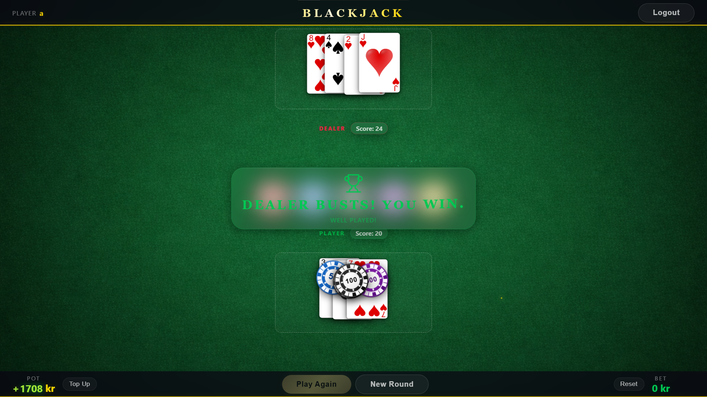 | 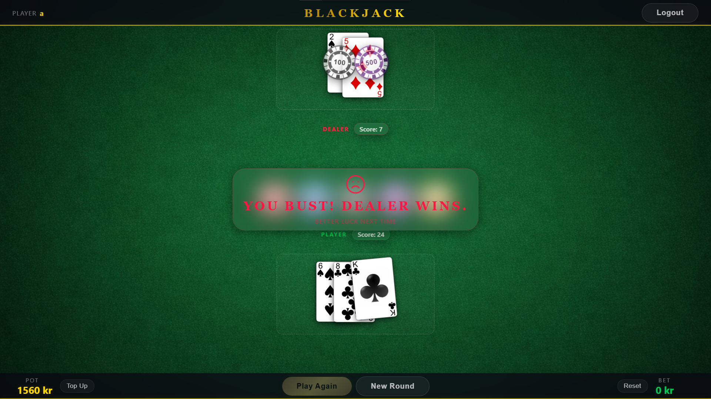 |

---

## About

Webbased Blackjack is a single-page application where users register an account, log in, and play Blackjack against a computer-controlled dealer. All user data is stored locally in the browser using `localStorage` in JSON format — no backend required.

---

## Features

### Authentication

- **Register** a new account with a username and password
- **Login / Logout** — session is persisted across page reloads via `localStorage`
- Each user starts with a pot of **500 credits**
- Bets and active chips are refunded on logout/login

### Gameplay

- Standard Blackjack rules — get as close to 21 as possible without going over
- **Hit** — draw another card
- **Stand** — end your turn and let the dealer play
- **Double Down** — double your bet and draw exactly one card (deducted from pot)
- **Natural Blackjack** detection (pays 2.5x total return)
- Dealer plays automatically, hitting until reaching 17 or higher
- Animated dealer card flip when the dealer's turn begins
- Playing cards displayed as images, updating with each move

### Betting System

- Place bets using clickable **chip buttons** (10, 50, 100, 500, 1000)
- Pot **decreases in real time** as chips are placed
- Pot **increases** when chips are removed or bet is reset
- Bet is deducted from pot when chips are placed; winnings/losses are settled against remaining pot
- Chips can be added before dealing and removed by clicking them or pressing reset
- **Play Again** — one-click rebet using your previous bet amount, chips are automatically rendered for the new round (only if funds are sufficient)
- **Top Up** button to add 1000 credits when funds run out
- **Zero-funds gate** — a modal blocks the table when your pot reaches 0, prompting you to top up before continuing
- Pot is clamped to a minimum of 0 — it can never go negative

### UI & Feedback

- Casino-themed design with animated background, particle effects, and glassmorphism
- Live score display for both player and dealer
- Contextual action buttons that update based on game phase
- Animated card dealing, chip flying, and celebration effects (confetti, fireworks, coin rain) on wins
- Result toasts with distinct styling for wins, losses, blackjacks, and pushes
- Pot value animation with gain/loss indicators (+ / − sign)
- Particle canvas properly resizes with the browser window

---

## Tech Stack

| Technology                      | Purpose                           |
| ------------------------------- | --------------------------------- |
| HTML                            | Page structure                    |
| CSS                             | Styling (CSS custom properties, animations, glassmorphism) |
| Vanilla JavaScript (ES Modules) | Game logic and DOM rendering      |
| [Vite](https://vitejs.dev/)     | Build tool and dev server         |
| `localStorage` (JSON)           | User data, passwords, and pot persistence |

---

## Getting Started

**Prerequisites:** [Node.js](https://nodejs.org/)

```bash
# Install dependencies
npm install

# Start development server
npm run dev

# Build for production
npm run build

# Preview production build
npm run preview
```

---

## Project Structure

```
src/
  js/
    app.js        # Entry point, event binding, and app state
    auth.js       # Register, login, logout logic
    blackjack.js  # Core game logic (deal, hit, stand, double, dealer AI, pot management)
    chip.js       # Chip value definitions and asset paths
    deck.js       # Deck creation, Fisher-Yates shuffle, and card drawing
    storage.js    # localStorage read/write helpers (JSON format)
    ui.js         # DOM rendering, animations, and visual effects
  styles/
    style.css     # All application styles
  assets/
    cards/large/  # Playing card images (52 cards + back)
    chips/        # Chip images (SVG)
    backgrounds/  # Table and background images
index.html       # Single-page HTML entry point
screenshots/     # Game screenshots for README
```

---

## How It Works

### Data Storage

All data is saved in `localStorage` under the key `blackjack_db` as a JSON object:

```json
{
  "users": [
    {
      "id": "uuid",
      "username": "player1",
      "password": "secret",
      "pot": 500
    }
  ],
  "session": { "userId": "uuid" }
}
```

### Game Flow

1. **Login** — user must be authenticated to play
2. **Place a bet** — click chip buttons to build your wager (pot decreases in real time)
3. **Deal** — both player and dealer receive two cards (dealer's second card is hidden)
4. **Play** — hit, stand, or double down
5. **Dealer plays** — dealer reveals hidden card and hits until 17+
6. **Settle** — pot is updated based on the result
7. **Play Again** — instantly rebet the same amount with rendered chips, or start a new round to change your bet

### Pot Logic

The bet is deducted from the pot when chips are placed, not at settlement. This means the pot always reflects your actual available funds.

| Result    | Pot Change        |
| --------- | ----------------- |
| Blackjack | +2.5x bet (return + 1.5x winnings) |
| Win       | +2x bet (return + 1x winnings)   |
| Push      | +1x bet (return only)            |
| Lose      | No change (bet already deducted)  |
